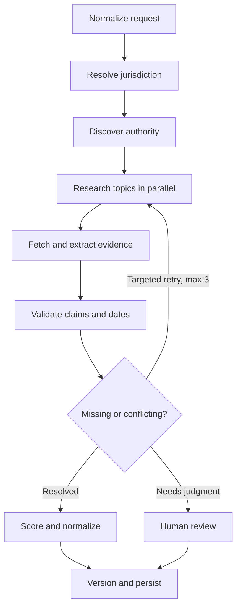

# State Trade Certification Intelligence Engine

## LangGraph + LangSmith build document

**Purpose:** Research, normalize, cite, validate, store, and refresh licensing and examination requirements for skilled trades across U.S. jurisdictions. The system must distinguish a state contractor license from a journeyman, master, apprentice, or technician credential. A missing statewide credential must never be interpreted as proof that no local or federal requirements apply.

**Initial trades:** electrical, plumbing, HVAC, refrigeration, hydronics, mechanical, and general/trade contracting. Extend the trade registry to welding, boiler operation, elevators, fire protection, gas fitting, solar/PV, and stationary engineering.

**Required geographic scope:** The entire United States: all 50 states, Washington, D.C., Puerto Rico, Guam, the U.S. Virgin Islands, American Samoa, and the Northern Mariana Islands. Treat these 56 primary jurisdictions as a required coverage manifest. Add federal requirements as overlapping records, such as EPA Section 608 for refrigerant work. When a primary jurisdiction delegates trade licensing, enumerate and research the affected counties, municipalities, or other local authorities rather than stopping at the state page.

**Required trade scope:** Electrical, plumbing, HVAC, refrigeration, hydronics, mechanical, and general/trade contracting across every primary jurisdiction. For each trade, research every credential level that actually exists in that jurisdiction, including apprentice/trainee, technician, journeyman/journeyworker, master, contractor, qualifying agent, and business entity. An inapplicable credential must have an evidence-backed scope finding; it must not simply be skipped.

Nationwide completion means every expected jurisdiction × trade × credential combination has a coverage-ledger entry with one of these outcomes: `validated`, `validated_not_applicable`, `partial_needs_review`, `blocked_source`, or `not_started`. Only the first two count as complete.

**Example request:**

```json
{"state":"Ohio","trade":"electrician","credential_level":"journeyman","locality":null,"as_of_date":null}
```

**Expected response:** A structured credential record with jurisdiction scope, responsible authority, eligibility, exam details, application and renewal rules, source-linked evidence for each material claim, unresolved gaps or conflicts, last verification time, and research status. If there is no statewide journeyman license, say so only when supported by adequate official evidence; identify local licensing as applicable or unresolved.

---

## 1. Operating principles

1. **Evidence first.** Store original documents and cited passages. Summaries and normalized records are derived artifacts.
2. **Jurisdiction before extraction.** Determine which government actually regulates the requested credential before researching its exam.
3. **Credential specificity.** Preserve the jurisdiction's official title and map it to a canonical level. Never merge contractor and worker requirements.
4. **Field-level provenance.** Every asserted material value references an exact passage, document version, URL, and location. Unknown is `null`, not a guessed default.
5. **Temporal validity.** Distinguish retrieval time, publication time, effective time, and the requested `as_of_date`. Retain old versions.
6. **Explicit conflicts.** Display incompatible claims with their sources, effective dates, and a reasoned resolution or a review status.
7. **Conservative negative findings.** `none_found` means research was inconclusive; `verified_not_required` requires documented evidence and a defined scope.
8. **Bounded autonomy.** Search iteratively with a maximum of three targeted follow-up rounds, then return gaps for review.

This is a regulatory research system, not a search → LLM → answer chain.

## 2. Stack and interfaces

- Python 3.12+, LangGraph, LangChain model adapters, LangSmith tracing and evaluations, Pydantic v2.
- PostgreSQL, SQLAlchemy, Alembic; optional pgvector for retrieval of large source collections. Keyword search and structured evidence remain the primary verification path.
- `httpx` for retrieval, BeautifulSoup or selectolax for HTML, PyMuPDF for PDFs, and Playwright for pages that require browser rendering. Add OCR only when text extraction fails.
- Configurable search adapter, LLM adapter, object storage adapter, and document parser. Optional providers may include Brave, Exa, Tavily, Firecrawl, Jina, Docling, or Unstructured. None should be mandatory for graph logic.
- Secrets from environment or a secret manager; do not log API keys, private responses, or raw secrets to LangSmith.
- A CLI and callable Python API first. Add an HTTP API or ContextOS integration after the core pipeline passes evaluation.

Search provider output is for discovery. A search snippet never counts as proof of a licensing requirement.

## 3. Request and output contracts

```python
from datetime import date, datetime
from enum import StrEnum
from pydantic import BaseModel, Field, HttpUrl

class RegulationScope(StrEnum):
    STATEWIDE = "statewide"
    LOCAL = "local"
    MIXED = "mixed"
    FEDERAL_OVERLAY = "federal_overlay"
    VERIFIED_NOT_REQUIRED = "verified_not_required"
    UNKNOWN = "unknown"

class ResearchRequest(BaseModel):
    state: str
    trade: str
    credential_level: str | None = None
    locality: str | None = None
    as_of_date: date | None = None
    force_refresh: bool = False

class CoverageStatus(StrEnum):
    VALIDATED = "validated"
    VALIDATED_NOT_APPLICABLE = "validated_not_applicable"
    PARTIAL_NEEDS_REVIEW = "partial_needs_review"
    BLOCKED_SOURCE = "blocked_source"
    NOT_STARTED = "not_started"

class CoverageRecord(BaseModel):
    primary_jurisdiction: str
    locality: str | None = None
    trade: str
    credential_level: str | None = None
    status: CoverageStatus
    research_run_id: str | None = None
    source_count: int = 0
    authoritative_source_count: int = 0
    unresolved_field_count: int = 0
    last_attempted_at: datetime | None = None
    last_validated_at: datetime | None = None
    review_reason: list[str] = Field(default_factory=list)

class Authority(BaseModel):
    name: str
    agency: str | None = None
    division: str | None = None
    role: str  # regulator | exam_owner | administrator | apprenticeship_sponsor
    official_url: HttpUrl | None = None

class EvidenceSpan(BaseModel):
    evidence_id: str
    field_path: str
    asserted_value: object
    source_id: str
    source_url: HttpUrl
    source_title: str
    publisher: str | None = None
    source_type: str
    authority_tier: int
    quoted_text: str
    page_number: int | None = None
    section: str | None = None
    text_start: int | None = None
    text_end: int | None = None
    retrieved_at: datetime
    published_at: date | None = None
    effective_from: date | None = None
    effective_to: date | None = None
    content_sha256: str

class FieldClaim(BaseModel):
    field_path: str
    value: object | None
    evidence_ids: list[str] = Field(default_factory=list)
    confidence: float | None = None
    status: str  # supported | conflicting | unknown | review_required

class ExamDetails(BaseModel):
    required: bool | None = None
    name: str | None = None
    owner: str | None = None
    administrator: str | None = None
    vendor: str | None = None
    candidate_bulletin_url: HttpUrl | None = None
    number_of_exams: int | None = None
    sections: list[str] = Field(default_factory=list)
    question_count: int | None = None
    time_limit_minutes: int | None = None
    passing_score: str | None = None
    open_book: bool | None = None
    allowed_references: list[str] = Field(default_factory=list)
    code_editions: list[str] = Field(default_factory=list)
    exam_fee: str | None = None

class CertificationRequirement(BaseModel):
    state: str
    state_code: str
    locality: str | None = None
    trade: str
    credential_name: str | None = None
    credential_level: str | None = None
    regulation_scope: RegulationScope
    statewide_license_required: bool | None = None
    regulatory_authorities: list[Authority] = Field(default_factory=list)
    statutory_authority: list[str] = Field(default_factory=list)
    administrative_rules: list[str] = Field(default_factory=list)
    minimum_age: int | None = None
    education_requirements: list[str] = Field(default_factory=list)
    experience_hours: int | None = None
    experience_years: float | None = None
    apprenticeship_requirements: list[str] = Field(default_factory=list)
    alternative_qualification_paths: list[str] = Field(default_factory=list)
    exam: ExamDetails = Field(default_factory=ExamDetails)
    application_url: HttpUrl | None = None
    application_fee: str | None = None
    background_check_required: bool | None = None
    insurance_required: bool | None = None
    bond_required: bool | None = None
    renewal_period: str | None = None
    renewal_fee: str | None = None
    continuing_education_hours: float | None = None
    continuing_education_requirements: list[str] = Field(default_factory=list)
    reciprocity_available: bool | None = None
    reciprocity_states: list[str] = Field(default_factory=list)
    reciprocity_requirements: list[str] = Field(default_factory=list)
    field_claims: list[FieldClaim] = Field(default_factory=list)
    source_evidence: list[EvidenceSpan] = Field(default_factory=list)
    missing_fields: list[str] = Field(default_factory=list)
    unresolved_conflicts: list[dict] = Field(default_factory=list)
    last_verified_at: datetime
    confidence_score: float | None = None
    research_status: str  # validated | partial | needs_review | failed
```

Money, score, and code-edition fields retain their source wording. Normalize them into additional machine-readable fields only after the unit and meaning are confirmed. For example, do not treat a scaled exam score as a percentage. Each populated material field must have a `FieldClaim` linked to one or more `EvidenceSpan` records. Lists need claim-level evidence for each item or for an explicitly complete list.

## 4. Authority and document ranking

| Tier | Source | Appropriate use |
| --- | --- | --- |
| 1 | Current statutes, administrative code, enacted rules, official regulator orders | Legal authority, scope, eligibility, license requirement |
| 2 | Licensing board or state agency pages, forms, official fee schedules | Current procedures, fees, applications, renewals |
| 3 | Official bulletin from the board's contracted exam provider | Exam logistics, content, references, duration, fees |
| 4 | Official apprenticeship sponsor or recognized apprenticeship authority | Registered apprenticeship requirements |
| 5 | Local government law and licensing authority | City or county credential details |
| 6 | Industry associations and training programs | Leads for discovery or independently identified voluntary credentials |
| 7 | Commercial exam-prep sites, blogs, forums | Discovery only; never override authoritative evidence |

Tier numbers do not mechanically decide legal meaning. A current official candidate bulletin can be the best evidence for an exam's time limit; an enacted rule controls eligibility when an older FAQ disagrees. Confirm the exact state, credential, and exam before accepting a vendor bulletin.

## 5. Jurisdiction and credential model

Resolve the regulator and licensing layer before extracting test details:

- Statewide worker credential, state contractor credential, local worker credential, local contractor credential, and federal overlay are distinct entities.
- Model multiple simultaneous authorities. A state may license contractors while cities regulate workers.
- Distinguish government license, registered apprenticeship completion, and voluntary industry certification.
- `credential_level` maps aliases such as journeyman/journeyworker, master, contractor, qualifying agent, apprentice, trainee, and technician; store the exact statutory term separately.
- If local licensing is possible and `locality` is missing, report the limitation and offer locality-specific research. Do not infer rules for every municipality from one city.
- For federal overlays such as refrigerant handling, produce a separate linked record rather than inserting federal exam rules into a state HVAC contractor exam.

Use an explicit negative-finding checklist: find the relevant official state authority, inspect its license inventory or governing law, search likely aliases, and look for express delegation to local authorities. If evidence remains insufficient, return `unknown`.

## 6. LangGraph state

```python
from typing import Annotated, TypedDict
import operator

class TradeResearchState(TypedDict, total=False):
    request: dict
    research_run_id: str
    graph_version: str
    jurisdiction: dict
    credential_candidates: list[dict]
    authorities: list[dict]
    candidate_sources: Annotated[list[dict], operator.add]
    retrieved_documents: Annotated[list[dict], operator.add]
    extracted_claims: Annotated[list[dict], operator.add]
    validated_claims: list[dict]
    conflicts: list[dict]
    missing_fields: list[str]
    normalized_requirement: dict | None
    field_confidence: dict[str, float]
    research_iterations: int
    errors: list[dict]
    review_reason: list[str]
    research_status: str
```

Parallel workers should emit immutable, uniquely identified items. Deduplicate at the join by canonical URL, content hash, and claim ID. Avoid concurrent mutation of one shared nested object. Save graph checkpoints so a review step can resume.

### Nationwide parent graph

Wrap the single-credential research graph in `NationwideTradeCertificationGraph`. Seed it with a checked-in jurisdiction registry containing:

```text
AL AK AZ AR CA CO CT DE FL GA HI ID IL IN IA KS KY LA ME MD MA MI MN MS MO
MT NE NV NH NJ NM NY NC ND OH OK OR PA RI SC SD TN TX UT VT VA WA WV WI WY
DC PR GU VI AS MP
```

The parent graph must:

1. Load the 56-jurisdiction manifest and the required trade registry.
2. Run an authority-and-credential inventory for every jurisdiction/trade pair.
3. Expand each inventory into the credential levels that jurisdiction actually regulates.
4. Create evidence-backed `validated_not_applicable` records for canonical levels that do not exist.
5. Detect state delegation to counties, cities, parishes, boroughs, townships, or other local authorities.
6. Build a local-jurisdiction queue from official state directories, statutes, local-code systems, and government sites. Record the discovery basis for every included or excluded locality.
7. Dispatch one `TradeResearchGraph` run per jurisdiction/trade/credential record with bounded global and per-domain concurrency.
8. Resume safely from checkpoints, retry transient failures, and avoid rerunning validated unchanged records.
9. Aggregate coverage counts and block national completion while required records remain `not_started`, `blocked_source`, or `partial_needs_review`.
10. Produce machine-readable JSON/CSV coverage exports and a human review queue.

The system must not pre-create the same credential list for every jurisdiction. The inventory stage discovers the official credential taxonomy first. Coverage is measured against that jurisdiction-specific inventory plus documented negative findings for common credential levels.

Local licensing requires an expansion cycle:

```text
Primary jurisdiction
  → delegation evidence
  → official locality inventory
  → local authority discovery
  → local credential inventory
  → credential research runs
  → locality coverage audit
```

If no authoritative list of regulated localities exists, generate a candidate inventory from official geographic entities, search each government domain for the supported trades, and leave uncertain localities in review. A sample of major cities does not qualify as nationwide completion.

Use a `nationwide_runs` table for parent-run status and a `coverage_records` table keyed by primary jurisdiction, locality, trade, credential level, and effective-date window. The parent graph should be restartable and idempotent; individual child failures must not discard completed jurisdictions.

## 7. Graph stages

1. **Normalize request:** Resolve state code, trade aliases, credential level, locality, and requested effective date. Reject contradictory or unrecognized inputs with a useful error.
2. **Resolve jurisdiction:** Identify likely licensing layers and credential types. Record evidence for a conclusion that a state license does or does not exist.
3. **Discover authority:** Find the governing board or department, legal authority, state license portal, and any local delegation. Separate regulator from exam owner and administrator.
4. **Discover sources:** Query official statutes, rules, boards, applications, fee pages, renewal pages, and official exam bulletins. Use third-party sites only to locate primary documents.
5. **Fetch and classify:** Retrieve HTML, PDF, text, and relevant DOCX. Store URL, resolved URL, title, publisher, MIME type, retrieved time, status, `ETag`/`Last-Modified`, SHA-256, and immutable raw artifact reference. Respect rate limits, robots and access controls; record an inaccessible source rather than inventing its contents.
6. **Extract requirements:** Produce structured field claims and short exact supporting passages with page/section offsets. Explicitly return `null` for unsupported facts. Record the applicable credential and effective dates.
7. **Resolve exam provider:** Follow the board's official link or documented vendor relationship to the matching candidate bulletin. Extract exam names, count, sections, score, duration, references, code editions, fees, and open-book rules.
8. **Validate law and dates:** Compare licensing obligations and eligibility to currently effective law. Compare exam logistics to a matching current bulletin. Detect future-effective, superseded, and undated material.
9. **Detect contradictions:** Compare claims only after normalizing credential, geography, units, fee type, and effective period. Preserve genuine conflicts and explain any resolution.
10. **Check completeness:** Produce targeted queries for material unknowns and unresolved conflicts. Retry only the affected topic, at most three rounds total.
11. **Score confidence:** Calculate evidence-backed confidence per field. Summarize overall completeness separately from certainty; a highly confident negative scope finding can coexist with unknown fees.
12. **Review gate:** Route critical uncertainty to a human with the relevant passages and proposed disposition. Persist a draft and checkpoint; do not auto-publish a contested conclusion.
13. **Normalize and persist:** Write a versioned requirement, claims, documents, evidence, source metadata, conflict records, and research-run metadata in one transaction.
14. **Finalize:** Return the record, status, explicit missing fields, conflicts, authoritative source links, and timestamp.



Use conditional edges to cap retry loops and distinguish `validated`, `partial`, `needs_review`, and `failed`. The graph may persist a partial result with explicit gaps; persistence does not imply approval.

## 8. Parallel research

After resolving the authority, fan out with LangGraph `Send` or equivalent dispatch for legal authority, eligibility, exams, fees, applications, renewal/CE, reciprocity, apprenticeship, and local licensing. Merge source and claim collections before cross-topic contradiction detection. Limit concurrency per host and per provider; use retries with backoff for transient fetch errors. Run one jurisdiction/credential per graph invocation so the resulting trace is readable.

A worker receives the resolved jurisdiction and credential, a narrow topic, source candidates, and the `as_of_date`. It returns source candidates, immutable documents, claims, errors, and follow-up queries. It cannot independently mark the full record validated.

## 9. Evidence validation and conflict rules

Validate each material claim with deterministic checks before any LLM judgment:

- Source ID exists and SHA-256 matches the stored document.
- Quote appears in the extracted document text, allowing documented OCR or whitespace normalization.
- Page, section, or character offsets point to the cited passage.
- Passage identifies the right jurisdiction, trade, and credential; a source about a different exam is rejected.
- Effective dates encompass the requested `as_of_date` or the record is marked historically scoped.
- Evidence supports the actual predicate: an exam being offered does not by itself prove the exam is required.

Then use a citation-support evaluator, with human sampling, for semantic entailment. If two authoritative sources conflict, store both. Favor currently effective law for obligations and a current official exam bulletin for test logistics, but flag mismatched source dates, wording, or delegated authority. Never silently pick a value solely because its numerical confidence is higher.

A conflict record includes `field_path`, competing values, source/evidence IDs, credential/locality/effective-period comparisons, severity, recommended resolution, rationale, and review status.

## 10. Confidence and review

Compute confidence from source authority, passage support, effective-date fit, and corroboration. An illustrative starting formula is:

```text
field_confidence = 0.35 × authority
                 + 0.35 × citation_support
                 + 0.20 × temporal_fit
                 + 0.10 × corroboration
```

These weights are heuristics to tune on a labeled evaluation set, not legal truth. Missing or contradictory evidence takes precedence over a numeric score. Never use the model's self-reported confidence as proof. Track field coverage and conflict counts alongside confidence.

Route to review when a core legal claim lacks primary support, the jurisdiction or credential level is ambiguous, an important official conflict remains, an apparent negative finding lacks sufficient search coverage, a source may be superseded, or confidence on a material field is below the calibrated threshold (initially 0.75). A reviewer can accept, reject, correct with evidence, or send the graph to targeted research. Preserve all actions in an audit log.

## 11. Persistence and versioning

Minimum PostgreSQL tables:

```text
jurisdictions                 states and localities
trades                        canonical names and aliases
credentials                   official title, canonical level, authority, scope
regulatory_authorities        organization and role
research_runs                 request, graph/model/prompt versions, status, times
sources                       canonical URLs, publisher, type, authority tier
documents                     source version, hash, raw object reference, dates
claims                        field path, value, status, confidence
claim_evidence                claim ↔ passage links
evidence_spans                quotation and exact document location
requirement_versions          normalized snapshot, effective and observation times
conflicts                     competing claims and resolution
validation_results            deterministic/semantic checks and reviewer decisions
change_events                 field-level changes between accepted versions
```

Use `first_seen_at`, `last_verified_at`, `valid_from`, `valid_to`, `superseded_by`, and `research_run_id` where applicable. Store both **legal effective time** and **system observation time**; they answer different questions. Do not overwrite old requirements when a document changes. Create a new version and a field-level change event. Dedupe identical bytes by SHA-256 while retaining each source URL and retrieval event.

A refresh compares HTTP metadata and hashes, re-runs extraction only for changed documents or affected claims, then evaluates whether accepted requirements changed. A changed webpage is a candidate update, not automatic proof of a legal change.

## 12. LangSmith observability

Set tracing via environment:

```bash
LANGSMITH_TRACING=true
LANGSMITH_PROJECT=trade-certification-intelligence
LANGSMITH_API_KEY=<secret>
```

Tag each trace with state, trade, credential level, locality, run ID, graph version, prompt version, model ID, requested effective date, and refresh reason. Trace discovery, retrieval, extraction, validation, retry routing, review, and persistence. Record counts of sources, official sources, supported claims, unresolved fields, conflicts, retries, errors, latency, and token/cost usage. Store source text securely with suitable trace redaction or sampling; do not dump entire PDFs into trace metadata.

## 13. Evaluation plan

Create a LangSmith dataset of manually verified, date-stamped examples. Initial cases:

- Ohio electrical contractor and plumbing contractor.
- Ohio electrician journeyman request, testing correct handling of state-versus-local scope.
- Texas journeyman electrician.
- Florida electrical contractor.
- California electrician.
- New York electrician, testing local jurisdiction nuance.
- Michigan plumbing and Pennsylvania HVAC as additional coverage.

Each example needs a verified `as_of_date`, official source snapshots, expected scope and credential, expected material claims, allowed unknowns, and annotated source passages. The names above are test targets, not prefilled regulatory answers.

Evaluators:

| Evaluator | Failure caught |
| --- | --- |
| Source authority | Weak source presented as governing authority |
| Citation completeness | Asserted field without evidence link |
| Citation support | Passage does not entail the value |
| Jurisdiction accuracy | Contractor/worker or state/local mix-up |
| Credential accuracy | Wrong exam or license level |
| Exam bulletin accuracy | Wrong state, trade, edition, or bulletin |
| Temporal accuracy | Superseded or future-effective requirement |
| Contradiction handling | Incompatible claims silently merged |
| Completeness | Required research dimensions skipped |
| Hallucination | Value absent from the cited documents |
| Negative-finding discipline | Unsupported claim that no license is required |

Use deterministic checks for hashes, offsets, links, schema, and coverage; use expert-labeled examples and carefully reviewed model evaluators for semantic support. Run regression evaluations when prompts, models, source ranking, graph routing, or extraction schemas change. Inspect individual failures, not just aggregate scores.

## 14. CLI/API behavior

```bash
trade-research run --state OH --trade electrician --credential contractor
trade-research run --state OH --trade electrician --credential journeyman --locality Columbus
trade-research refresh --state OH --trade plumbing --credential contractor
trade-research nationwide inventory --trades electrical,plumbing,hvac,refrigeration,hydronics,mechanical,contractor
trade-research nationwide run --manifest us-56 --resume --max-concurrency 24
trade-research nationwide expand-local --resume
trade-research coverage export --format json --output coverage.json
trade-research coverage audit --fail-on-incomplete
trade-research evaluate --dataset regulatory-gold-v1
```

The programmatic `research(request: ResearchRequest) -> CertificationRequirement` entry point should also return a run ID and status. Add `run_nationwide(manifest, trades, resume=True) -> NationwideRunResult` for complete coverage runs. Surface a readable report with the state/local finding at the top, then eligibility, exam, application, renewal, reciprocity, evidence links, and unresolved questions. Provide JSON output suitable for ContextOS cards, timeline change events, and a visualization view. The UI should expose the source passage behind each value and a national coverage dashboard with filters for jurisdiction, trade, credential, status, confidence, conflicts, and last verification date.

## 15. Delivery sequence

1. **Foundation:** Define schema, database migrations, adapters, content store, and graph checkpoints. Build deterministic citation and versioning tests.
2. **Pipeline validation:** Implement Ohio electrical contractor and Ohio journeyman scope research end to end, then add Texas, Florida, California, New York, Puerto Rico, and one local-delegation case. Verify official sources manually and record baselines. This validates the pipeline; it does not reduce the required national scope.
3. **National inventory:** Run authority and credential discovery for all 56 primary jurisdictions and every required trade. Create the initial coverage ledger, including evidence-backed not-applicable records.
4. **Primary-jurisdiction research:** Complete every discovered credential across all 56 jurisdictions for electrical, plumbing, HVAC, refrigeration, hydronics, mechanical, and general/trade contracting.
5. **Local expansion:** For every state or territory that delegates licensing, enumerate and research the applicable counties, municipalities, and other local authorities. Audit the locality inventory for gaps.
6. **Evaluation and review:** Label gold examples across every regulation pattern, run LangSmith regression suites, and resolve or publish the review queue status.
7. **National completion gate:** Run the coverage audit. Release the nationwide dataset only when every required record is `validated` or `validated_not_applicable`; publish blocked and review records explicitly if a provisional release is required.
8. **Refresh and integration:** Add scheduled recrawls, change detection, notifications, API, and ContextOS display with jurisdiction-level freshness service levels.

Do not claim nationwide coverage until state/credential combinations have actually been researched and verified.

## 16. Acceptance criteria

- Given a state, trade, credential, and optional locality/date, the graph returns a typed record with a research status.
- The checked-in manifest includes all 50 states, Washington, D.C., Puerto Rico, Guam, the U.S. Virgin Islands, American Samoa, and the Northern Mariana Islands.
- The nationwide parent graph inventories and researches every required trade in all 56 primary jurisdictions, resumes interrupted work, and exposes a coverage ledger.
- Where licensing is delegated, the system creates and audits a local-jurisdiction inventory instead of representing one sample city as the state rule.
- Every expected coverage record is `validated` or `validated_not_applicable` before a run can report national completion.
- It distinguishes regulator, exam owner, and exam administrator and never transfers one credential's exam to another.
- Every asserted material field links to a verifiable stored passage; unknowns stay unknown.
- It distinguishes statewide, local, mixed, and federal requirements; a negative license finding requires documented support.
- It detects conflicting experience, score, fee, or edition claims and records the affected source versions.
- It stops after three targeted research retries and exposes unresolved fields.
- It versions source documents and requirements without erasing past results.
- LangSmith traces and labeled regression cases show citation support, jurisdiction accuracy, temporal accuracy, and review decisions.
- A human can inspect and amend a contested result before publication.

## 17. Copy-paste build command for a coding agent

> Build the complete nationwide State Trade Certification Intelligence Engine described in this document. The required production scope is all 50 states, Washington, D.C., Puerto Rico, Guam, the U.S. Virgin Islands, American Samoa, and the Northern Mariana Islands, plus federal overlays and every county or municipality discovered where trade licensing is delegated. Cover electrical, plumbing, HVAC, refrigeration, hydronics, mechanical, and general/trade contracting, and inventory the credential levels that actually exist in each jurisdiction. Use Python 3.12+, LangGraph, Pydantic v2, PostgreSQL with Alembic, configurable search/LLM/retrieval adapters, and LangSmith tracing and evaluation. Implement both the single-credential `TradeResearchGraph` and restartable `NationwideTradeCertificationGraph`; the 56-jurisdiction manifest; national authority and credential inventory; local-jurisdiction expansion; coverage ledger and completion audit; typed request, evidence, claim, conflict, coverage, and normalized-record contracts; official-source discovery; HTML/PDF retrieval with immutable SHA-256 documents; credential-aware extraction; exact passage citation checks; effective-date and contradiction validation; three-round targeted retry routing; versioned persistence; and human review checkpoints. Validate the pipeline first with Ohio, Texas, Florida, California, New York, Puerto Rico, and a local-delegation case, then execute the entire national manifest. Add individual and nationwide CLI commands, resumable bounded concurrency, JSON/CSV exports, and a coverage dashboard API. Do not report nationwide completion while any required record is unstarted, blocked, or awaiting review. Do not populate unsupported fields or treat search results as evidence. Document setup, secrets, migrations, operations, recovery, example invocations, source limitations, evaluation results, and national coverage results.
